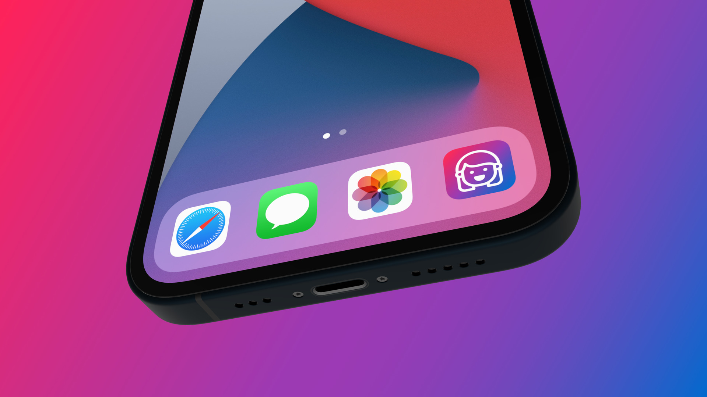

#  Main objectives of this Core Data and SwiftUI project

## DEVOTE
In this SwiftUI tutorial, we will develop a task manager iOS application with Core Data integration. This is not a project with a boring user interface. This iOS and iPadOS application provides a personal touch and feel.

## Learn how to integrate Core Data with SwiftUI

Apple's Core Data framework helps developers to manage and interact with data on a persistent store. It works on iPhone, iPad, Mac computer, or even Apple Watch.

When we start from a brand new project, the easiest way to use the Core Data framework is by enabling the Core Data option on the setup screen. By doing that Xcode will generate all the required file templates with code and the managed object model for us.

This Xcode 12's new Core Data template comes with the SwiftUI app life cycle integration and the required Core Data Model. This is why it is worth knowing how to get started with this new template and how to create a working application.

## TOPICS WILL BE COVERED:
1.  How to integrate Core Data with the SwiftUI App Life Cycle
2.  How to get familiar with Xcode's new Core Data template
3.  How to create a basic Widget for iOS and iPadOS devices
4.  How to develop a Widget sets with different sizes (small, medium, large)
5.  How to set up the Preview to test the different Widget sizes on the Canvas
6.  How to Create, Read, Update and Delete a database item (CRUD method)
7.  How to show SwiftUI views conditionally
8.  How to switch from Light mode to Dark mode the app's appearance
9.  How to store the app's appearance using App Storage
10. How to create a visual effect with SwiftUI (blur, overlay, display mode)
11. How to add the required assets for the Widget extension
12. How to develop a custom Toggle style and make a checkbox

13. How to improve the User Experience with sound effects
14. Practice how to use Apple's Feedback Generator and implement haptics

# Images

Image("LaunchScreen.jpeg")

# What is Core Data
Apple's Native Persistent Storage is Core Data.  This type of persistent storage is also known as an Object-Relational Machine/ Model.  

We take a look at:
1.  What is Core Data 
2.  The Core Data Stack
3.  Core Data Template

 ##  The Core Data Stack / Framework
 We can use  Core Data to save the applications' permanent data for offline use, to cache temporary data, and to add the undo and redo functionalities to our app on a single device.
 
 Core Data is available on just about every Apple platform.  
 1. The Core Data is a model layer in the application.   
 2. Core Data can store, retrieve, update, and delete data.  
 3. Core Data manages the object graph.
 4. Add Undo and Redo functionalities.
 5. Cache temporary data
 6. Share or synchronize data using Cloud Kit.
 
 What is an Object Graph?   Notice the example of Movie, Genre, and Actor. 
 
 Core Data is not directly a database.  Rather is an ORM to many types of databases systems such as:
 *  XML
 *  Binary
 *  SQLite
 *  In-Memory
 
 Remember your model for an ORM Stack (dissertation)
 
 ## Class Generation
 Working with Core Data entails working with the classes for relational entities.  The class code generation can occur in the following manners:
 1. Manual
 2. Class Definition
 3. Extension
 
 Chose Manual/none to edit the properties in your managed object sub-class, for example, to alter access modifiers and to add additional convenience methods or business logic.  In other words, Core Data doesn't provide or produce the code generation for managed objects.   We the developers do that in this case.
 Chose Class Definition option when you don't need to edit the properties or functionality of the managed object sub-class and properties files that Core Data generates for you.  This is the default.
 Choose Category/ Extension to add logic to the Managed Object to add additional convenience methods or business logic inside your managed object sub-class.  This is more or less an extension of Chose Class Definition.  In this case, we develop using the grandfather design pattern/principle.  The extension provides esentially the same thing as a sub-class to the entity class definition.   The extension allows the developer to add features to the Class Definition without actually editing the generated class definition.  
 
 Note: this approach is very similar to the Enterprise Object generation observed under the Java WebObjects frameworks from at least 2005.  The Java WebObjects Frameworks represents WebObjects version 5 and version 6 exist as Swift Objects.
 
 Observe how the generated classes are created.  Observe during the commit of this project to the GIT repo. 
   
I did the subclassing shown in part 2. I  discovered that the Xcode code generator produces error filled code.  Maybe, this is a feature?  Maybe, we need to fix this connection between Obj-C and Swift.  After all, we want the ability to apply business logic in Apple's flagship data persistence tool.   It worked great in 2005 at WWDC and I could use it then for some helpful apps.  I hope to use it now that Swift Objects is WebObjects 6. 

## Persistence Controller 

Now, the lesson has shifted to the Persistance Controller.   Xcode does generate a defacto module for Core Data that we store in the Model group.  This is the Persistance module and Xcode generates a structure for this implementation.  It may help to look up old Objective C and Java WebObjects code to see how this module is generated there.  I believe that each produce a special class to manage the persistance controller.  That class I believe is a subclass of the big persistance controller.

The structure made for the Persistance Controller is literally named that.  I have no idea if this has a parent, but structs tend not to have the parent structure classes do.   Also, some singleton patterns show up in defining accessors for shared and preview.  The structure also contains a property for the persistance contrainer. 
The instructor recommends removing the generated comments in the Preview and initializer for this structure.  This structure and its singleton share sets up the three basic parts of the ORM model, context, and store coordinator. 

Using the persistent container is the preferred way to initialize our core data stack and load our core data model later.

Remember the storage mechanism typical for Core Data.  It is possible to generate a persistence store cooridinator and modules for using persistence stores other than these defacto types.  

The preview method provides a singleton / class method initialize an in-memory store persistance store coordinator.  This method loads items in the store.  One can make similar methods to load such a store from plist or JSON backups.  The premise in these cases is that we load the files and perruse through loading as we go.  This method is helpful if we are transfering data from one data store to another.  

Also, I look forward to reviewing my work on making whole persistent store frameworks for integrating RDBMS as the persistence stores.  This is handy if we are deploying a cloud based app to enable sharing and distributed operations. 

## Managed Object Context
Part 2
Time index 19:55 

Here we use DevoteApp as the main entry structure into our application.  The "DevoteApp" structure has a @main directive right before the structure declaration.  It also has the member constant persistenceController declared and initialized with a shared persistence store.  This item itself is constant as it only needs to point to the mechanisms providing "Core Data" access.  
What does the .environment directive do in Swift?   An environment is a property wrapper that reads a value from the view's environment.  

For example, the Devote app provides a body member that provides a getter.  This getter opens a closure for WindowGroup that initializes a ContainerView with the environment property wrapper.
This .environment wrapper therefore makes these "variables" fairly global to the application and enforces that we access them in this way.  When this variable changes anywhere within the app, these wrappers ensure that view that depend on them also update.
Therefore, with this single line of code in DevoteApp.body, the managed context is injected for the Core Data contained in the whole swiftUP app hierarchy, and it's all child views.  

## So what are the prerequists that we covered?

    *   We get a Core Data Model and Object Graph Editor.
    *   Setting up the Persistent Container a
    *   Managed Object Context in the Environment 
    
## Fetch Request :  The big piece of USING Core Data

Notice in Content View, there is a "@FetchRequest" directive.    What does this "@FetchRequest" do with Core Data?
A quick Google search responds with the following:
    SwiftUI gives us a dedicated property wrapper for working with Core Data fetch requests, and it allows us to embed data directly into SwiftUI views without having to write extra logic.
The Hacking with Swift (https://www.hackingwithswift.com ) provides some useful details about this wrapper.  
The Apple Developer Documentation found at (https://developer.apple.com/documentation/swiftui/fetchrequest) says this is a property wrapper that declares a Fetched Result property that provides a collection of Core Data managed objects to a SwiftUI view.  Note: this is similar to Fetch Request class / generator pattern in Objective-C Cocoa. 
Apple recommends keeping fetch requests as a private member of classes and structures.  This prevents initializers from accidently setting such values.  For most other members, the compiler sets up values for the initializers to cover all basis.  The making of this member private prevents this.

So in Content View, there is a private variable "items" of type "FetchedResults<Item>".  It kind of reminds me of STL types in C++.   But, this mechanism with the "@FetchRequest" sets up a plist structure formed by querying the Core Data persistence store.  The "items"  variable is then used in the body with a For each closure.  Each item in items is used to make a table cell.  For example, a Navigation link is made hodling "Item at " with a label filled with formatted timestamp.  

Time stamp 21:00 in Part 2 of Udemmy's "Devote App" exxample

Apple provides a default set of code on making a "Core Data" app.  This provides a working skelton with the before mentioned Content View body.  In addition, Apple includes methods in the Content view for adding and deleting items.  These actions respond to the add button, and specific elements selected via the edit button. 
The instructor recommends that we clean up Apple's example code in order to better understand it.
The comment in the "Add" method catch recommends replacing the implementation with code to handle the error "more appropriately."  The fatal error call causes the application to generate a crash log and terminate.    Apple recommends not using such a call in shipping application.  The "delete" method has a similar set of comments.

The "@Environment(\.managedObjectContext) private var viewContext" injects a managed object context (an environment where we can manipulate Core Data objects entirely in RAM).  This property acts as a scratch pad to retrieve, update, and store objects. 

At time index 22:05 the instruct goes over again the fetch request.
The "@FetchRequest" provides a property with a sort descriptor.  This sort descriptor is represented by a plist array.  In this case, it is a single item array and the item is a sort descriptor initialized with "\Item.timestamp" and ascending set to true.

A Fetch Request property wrapper can potentially have four parameters such as:
    1.  Entity
    2.  Sort descriptor
    3.  Predicate
    4.  Animation
    
In this case, we have the sort descriptor and animation.  If we have an entity, this is a declaration of the "entities" we want to query.  Sort descriptors determine order.  Predicates determine filters on the data.  Animations determine visual actions consequence of change the results? 

The instructor has us mark a section for the functions in between the member properties and the body.  This has a distinct structure reminiscent to Pascal (aka variables, functions, and main execution body).

Also, the instructor recommends moving the Date Formator to a utility module.  The instructor calls this file "constant" for things like Data formatters.  But, the instructor may use this for other global  constants and functions.  This means that this constant can't be private. 
The UI and UX segments the instructor makes for the "Constant" module gives an indicator.  We should expect other UI and UX items to show up as constant items, closures and functions.

## Conclusion to Core Data Intro and Understanding XCode's Core Data template.
First we created a Core Data container for once the app starts.  
The Core Data Stack provides a foundation containers and how Core Data provides persistent stores.
### The Core Data Framework:
We can use  Core Data to save the applications' permanent data for offline use, to cache temporary data, and to add the undo and redo functionalities to our app on a single device. 
We inject the MOC into the app.

Recall the use cases.

There is a code generation to make classes where we can build business logic for our managed data. 

# The big example here:  A Fully Functional To Do List application
This kind of app is kind of typical for introducing Core Data.  Believe or not, I can remember Aaron Hilligaus giving us a lesson on Core Data in student Sunday part of WWDC 2005.  This was actually a pretty nice introduction and what little did I know.  Aaron was showing us what Apple had introduced with OSX Tiger (10.4).  Up until this point, 
    0.  Cheetah
    1.  Puma
    2.  Jaguar
    3.  Panther
    4.  Tiger
    
    These big cat releases provided what I called the working UNIX out of the box.  These OSX releases had toy like appeal as anyone with a decent education in the computer sciences could figure these out.   Realistically, most anyone else could, too.  These were vast improvements over macOS 9 that did not offer intuitive connection to system operation.  Well, maybe if that is what you grew up with.  With the first big cats of OSX, I could then figure out macOS 8 and 9.  Development for OSX was simple UNIX and the "MAKE" paradigm worked straight out of the box.
    Now, we had Core Data and I learned about application loops and garbage collection.
    
    Now, we can build a Core Data application like a To Do List, and it is different in Swift.  But, it is made for people who can't go back in time and be raised in Gen X. 
    With just a few lines of code, Core Data gives Swift the ability to fashion a straight forward app of this kind.  
    
 
# Begin App Refinement
Begin part 4 of the "Devote App" example

In this particular lesson, the instructor lays out the foundation of the layout and design.  This applies mostly to the appearance.  There are a few bullet points here:
    *   Linear Gradient: 1st background
    *   Image:  2nd background
    *   ZStack:     Main container
    *   Inset grouped:  List style
    
Let the coding begin in the Content View.

Oh, this is a good time to learn how to do that code snippet for MARK comments.
The key to this is the little completion segment in the snippets tool kit, in particular for each snippet.

## Introduce iPad Support
We add a modifier to the navigation view and to the following: 
    * The ".navigationViewStyle(StackNavigationViewStyle)" at the end of the Navigation View closure.
    *   Adjust the background
    
## Background 
We add a new background to this view, since we will use this specific gradient.
Therefore, it's worth creating a reasonable property for that purpose.  The constant module is a good place to place such a gradient reference.

By default, iOS imposes vertical padding.  This specification on the list maximizes the list on iPad devices.

##  Background Image

The last task in this lesson is to add a background image on top of this linear gradient background. 
How do we do it?  We need to create a reusuable Swift view with a single image in it.
This means a new View protocol following module.

Here we create a new file from the SwiftUI View template that we call the BackgroundImageView.
The instructor recommends we pay attention to the fill view modifier, it makes sure that the image will scale to fill its parent's view no matter what, while maintaining its aspect ratio so it won't be distorted. 
There is also cause to follow the the antialias modifier.  

Last but not least, we adjust the content view structure.  Here we work on modifying the toolbar and background.

## So we have the stellar app basic appearance
There is supposedly a Debug Preview mode for the canvas.  This supposedly gives us the ability to work with the persistent store in memory from the canvas.

Otherwise, test the application against the simulator or real hardware.    

# Create a New Entry Form for The Task Item

The instructor says that this an exciting lesson.  The lessons includes practical and app building techniques.
The new demo does not have a text view like the last commit.  The new demo hides the textfield and save button from the device screen.  Question, can we make such a button for making a new entry switch between "add" to new entry textfields and save buttons?  Let us see what the instructor has in mind.
The instructor shows the following features in the demo:
    *   New Task button
    *   Entry Form: New Task Item View
    *   Blank view: Transparent background
    
Thus we replace the entry view of the previous prototype with a new add task button on the top area.  When we tap the add button, a new full screen view shows up with the previously example's Entry form.    These new features include the following:

    *   Automatic Keyboard Avoidance
        **  SwiftUI pushes up the text field automatically
        **  No extra action required for developers
    *   The app's layout gets more complex with multiple layers, but the straight forward utility makes it worth while.
    *   We need a new Swift UI module for the new task form.  "NewTaskItemView.swift"
## Breaking Code - Fix it
Time Index 2:45 (Lesson 5)
We break the code, kind of on purpose, to make a better view to use with Core Data.   We commit this to the GIT repository to mark where we break the code and how we fix it.

    1.  Missing context
    2.  Missing "task" (well, I saw that fix coming)
    3.  Missing view context - Does the view context also carry the MOC and therefore the connection to the Core Data stack?
So what is next to give this view the desired look?  

## Adding/ Polishing The Details
Here we add details to Text field and button's vertical stack.   These improvements deal with color and general shape of the "view" we are using to add a new "task."
Time Index: 6:15

Commit at time index 7:10

## Layout Updates
This is where we put this new item view into the content view.

We make marked sections within the body of the context view to aid us.  We need to know where features go such as:
    1.  Header
    2.  New Task button
    3.  Tasks
    4.  New task item

So, we add a spacer in the "header" section so the "design" of this view can breathe.
We commit at 8:52 in the video so we can see the results so far.

## Custom Button
We do a lot of work up to time index 11:32  There are few gotchas to watch out for.

When we test this prototype, we see that the button does bring up the NewTaskItem view on top of the list.  However, we can not dismiss this view, no matter what we do.  

## Blank Layer
Time index 12:02 
We create a "blank view" to provide an or condition that we can reach.
We add this blank view to the conditional for the show new task item to help dismiss the New Task Item View.  This demo occurs at Time index 14:00

Yet, what is supposed to happen if the user "adds" an item/task?

## Dismiss With Binding

Here we add a binding for "isShowing".  This binding is turned false when the addItem is called.  It is turned to true in the preview with :
    "NewTaskItemView(isShowing: .constant(true))"
    Futhermore, the call is changed in Content view to 
    NewTaskItemView(isShowing: $showNewTaskItem)
    
    * This code fix links the show New Task Item condition to the NewTaskItem View.
    *   It also makes it possible to "add" a task and then dismiss the New Task Item View.
    
## Test the New Task View with Binding

# Chapter 6 - Let's Develop a Custom Header

Features of this chapter are as follows:
    *   New Header - Custom Style and buttons
    *   Preferred Color Scheme - Automatic Switch
    *   Appearance - Light and Dark
    *   Custom Component - Manual Switch between Light and Dark (the moon icon in the header)
    

    Notice that when the toolbar is removed and navigation bar is hidden, what happens to that region in the view.  

## Baseline concept of the Custom Header

In this case, we are deploying a horizontal stack to carry a title, edit button, and appearance button.  
The horizontal stack gives us a lot of play room to adjust or elements the way we want.  Each element has generator methods that add features to a description stack.  That stack defines the appearance of each thing in the view. 
So, we add a text label (simply text) with a string "Devote".  

##  Appearance Button
Time index 4:06

There was a time when Apple had its Interface Builder (even its storyboard).  The nice thing in these cases is that you did not have to be an artist, either.  Apple understood software engineers did not have to electrical engineers, and even those who are get a value in software abstraction done well.  Steve Jobs understood this in NeXT's interface builder as most scientist who used NeXT also were not artist.  They needed tools to express a basic scheme to operate their tools.  This provided a kind of guide.
These lessons here provide a guide also and it is worth playing around with each of these basic items, such as buttons, text labels, edit boxes, stacks, etcs.  
The library button is good legacy for IB and Story Board to keep the snippets that represent the basic items here.  Then, follow the documentation for all of the generator methods and see what they do for the item in question.
 
## Light and Dark Mode

Dark mode is a system variable and to access it, we need to use the App Storage modifier in declaring this "state" member variable.  It is still a boolean.  Although, Swift implements this as an object and has a method toggle() for flipping its state. 
So, we can use the state of this variable to switch between icons that represent this in the header.  Likewise, we can set the button to toggle the value.  When this happens, we need some means that changes the art between its light and dark mode forms. 
Reference time index 6:24
This is partially controlled in the "DevoteApp".  AKA, the module generated by XCode as the entry point for the app.  The structure with a @main modifier.

## Preferred Color Scheme

Now that we the App Storage in the content view, we do it in the @main entry point.  In "DevoteApp", we setup this App Storage property.  By default, we set this value to false.  Why not just inherit this from the system?   Not sure, but we do use it in the "DevoteApp" window view.  
When we call ContentView in the Devote App, we use the .preferredColorScheme generator method to set it value acquired or set when Devote App itself is loaded.   I can presume that during the initialization of DevoteApp, a test for preferredColorScheme is also called.  If it is found, the system can set this value to the default of the system.  So, does us fiddling with the Color Scheme change it across the system?

Also, is this idea good across our own app?  Well, try adding a new task.

The preferred color switch - automatic switch does a global for the app, for sure.  Reference 8:45 in the tutorial.  
Custom components must adjust manually.  What does that mean?

## Light and Dark Theme
So, we add this App Storage property to the custom views, in particular New Task Item View.
Another way one can conceive for doing this color scheme is to use the constants and have a colors group.  This allows us to specify a list or dictionary of items that we apply colors to, and define their light and dark mode colors.

Luckily, we only have one custom view, the New Task Item View.  
We do this selection on for the background of the text field and vstack.

Each of these selections are handled by the ternary operator.  This is as good as a switch or if-then block in terms of operation, but the goal of concise description is obtained.

# Chapter 7 - Improve the design of the task item

We introduce the task item - custom component to include some kind of completion.  This is in the entity and we just provide a way for this to be edited in the list. 
    *   Task Item   - Custom Component
    *   Checkbox    - Toggle Style
    *    

We will also learn how to customize the look and feel of a SwiftUI toggle.

We can also customize the toggle style (checkbox).

The instructor gave a hint that we are going old school on app development.  What does this mean?  
To be fair, NeXT had Interface Builder and the iPad introduction brought with it Storyboard.   

Core Data enables the Create, Read, Update, and Delete (CRUD) design pattern.  The CRUD design pattern simplifies many of the database operations, especially outside the search mechanisms.
For this ListRowItemView, we need to create a toggle element and inside it we will insert. 
This also uses the publish - subscribe/action pattern.
The pattern operates with the following:
    *   Publisher   - Parameter
    *   Action      - Parameter
Notice the toggle onRecieve listener / action listens for an object will change from item.  If such a condition is triggered, then this closure tries to save the view context.  In other words, this listener responds with a publish action. 
Now is a good time to commit to the repository as we are about to change the Content View. 

This effort involves creating a List Row Item and Checkbox Style. 

Notice that we can do this with a preview for the List Row Item, but we need a constant for item.  

Also notice, Xcode fusses over .animation(.default) in the Checkbox style.  What do we do?

# Chapter 8 - Learn How to Create a Custom Visual Effect in SwiftUI

This effect that we add utilizes the following:
    1.  Blend mode  - SwiftUI Modifier
    2.  Blur effect - SwiftUI Modifer

What does this mean?  The Blank View is shown when adding a new item (in Content View).  Look in the Blank View.  We can add these features such as blend mode and blur effect to change the background picture underneath.   This gives a notion that the add task is the only action to pay attention to while it is there.  This is the majority of the lesson up until 7:00 into the lecture.
  
  At 7:52, we add .blur to the VSTACK end.  What does this do?
  
  Notice there is something to watch out for.  We need the .onDelete part to the ForEach and it is ease to undo that effort when changing to a custom Row view.

# Chapter 9 - Dealing with UX and Sound Design

Improve the user experience.  
    *   Sound effects   - user experience
    *   Haptic Feedback - user experience
    
Introduction shows us the gist of the app improvements with sounds and haptic feedback for 1:50.  

The steps taken to accomplish this: 
I created a new utility module called SoundPlayer.  I imported AVFoundation into this module and created a function to play some audio.

We setup a well known function to play the selected sound from the local app bundle.

#  Chapter 10 - Introduction to the new Widget API

